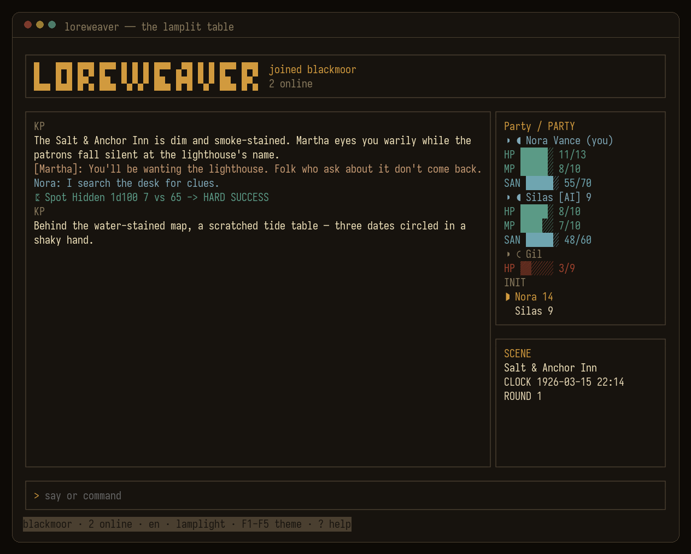
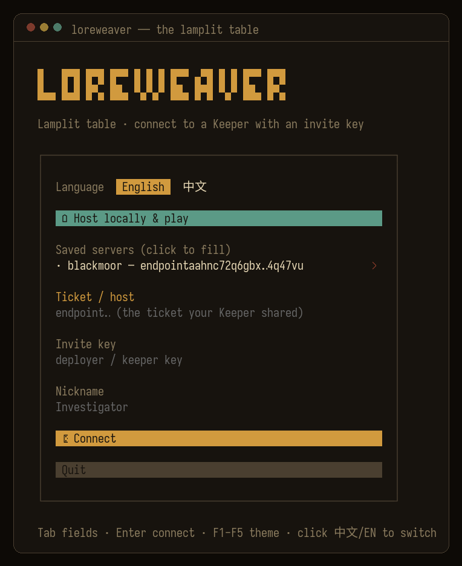
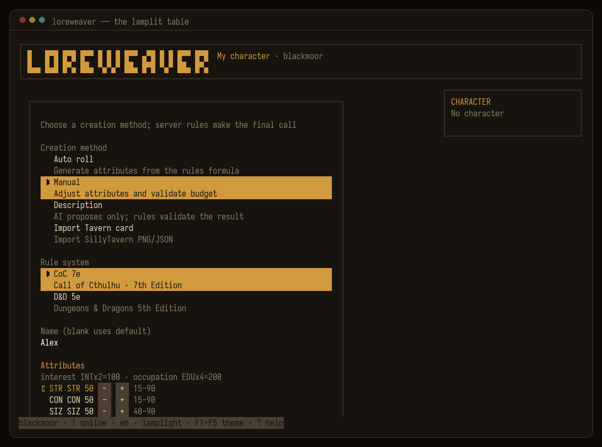
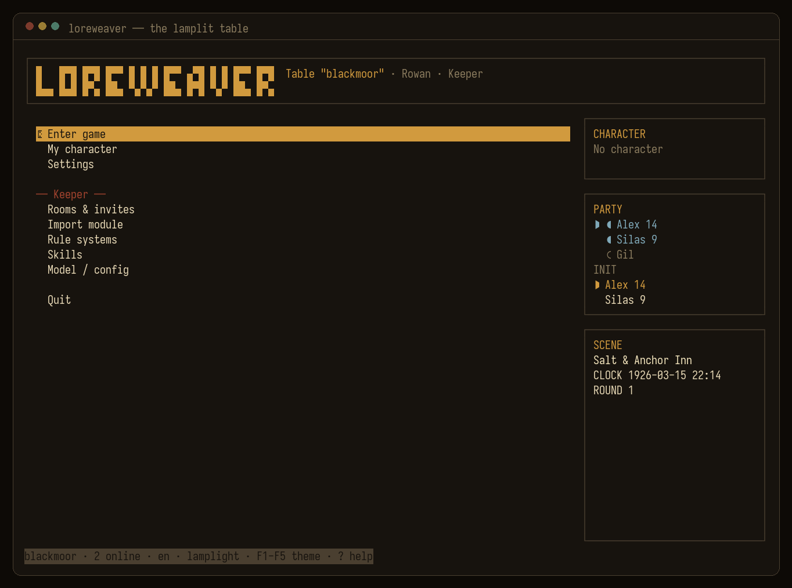
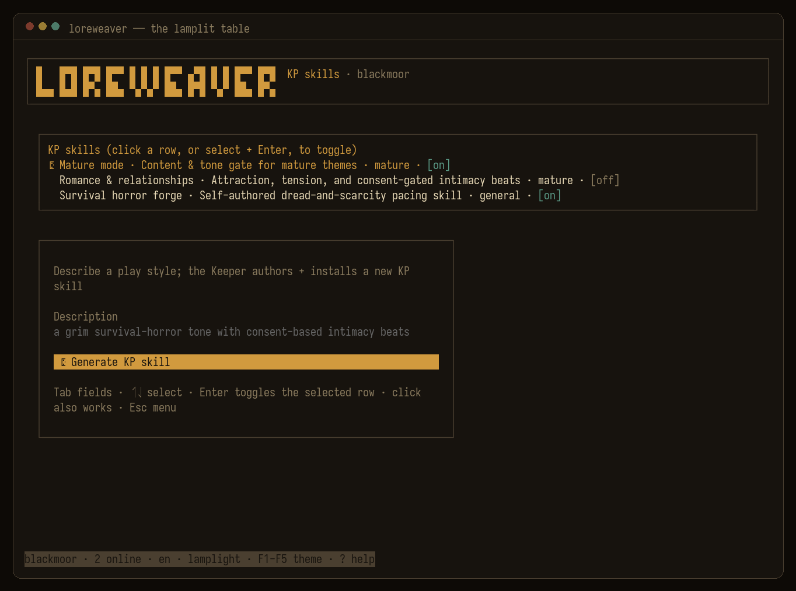

# Loreweaver

**"Your favorite character shouldn't live only in a chat window."**

Take them into a full world: dice decide what succeeds, rules keep it honest, and what you live through together leaves marks. You adventure together, fail together, and see the story through to the end.

Neither of you knows the script — **you create the story together.**

*English · [中文](README.md)*

Loreweaver is an open-source AI Game Master: you and your friends bring the characters — including the companion cards you already love — and the AI Keeper runs the table. It reads the module, remembers the world, plays every NPC and guards every clue — you just sit down and say what you do. What separates it from "chatting with an AI" is simple: **the dice are real**. Checks, damage, sanity — all rolled and resolved by code, and the AI's only job is to tell the result as a story. **The AI tells the story. The code keeps the score.**

Ships with Call of Cthulhu 7e and D&D 5e (SRD), speaks English and Chinese, and the server runs on your own machine.

[](https://github.com/1A7432/loreweaver/actions/workflows/ci.yml)   

> **Honestly:** this project is young, built mostly by one person working with AI. The dice and rules core is the solid part, watched by a full offline test suite; the terminal client is comfortable now. Networked multiplayer and AI-GM reliability are still being polished — what works and what doesn't is spelled out in the [roadmap](docs/roadmap.md).



## Starting a game is one button

Install the client, click the green button on the connect screen — "**Host locally & play**" — and that's it. There is no step two.

It downloads the server build for your OS (self-contained — **no Python, no environment setup**), starts it, issues your Keeper key, and drops you into the main menu as the Keeper. We've verified the whole path from clean installs of Windows 10/11, macOS (Apple silicon), and Linux.

Installing the client is one line. macOS / Linux:

```bash
curl -fsSL https://raw.githubusercontent.com/1A7432/loreweaver/main/clients/install.sh | bash
```

Windows (PowerShell):

```powershell
irm https://raw.githubusercontent.com/1A7432/loreweaver/main/clients/install.ps1 | iex
```

Once installed:

```bash
loreweaver          # start it, click the button
loreweaver update   # upgrading is one line too
```

The server builds are also yours to take and run long-term on a machine of your own: [GitHub Releases](https://github.com/1A7432/loreweaver/releases/tag/latest) has `loreweaver-server-*` for Windows / macOS / Linux (x64 + arm64) — unzip and run, with a `--doctor` self-check built in.

## Bringing your friends in

Once you're hosting, your screen shows two things: a **ticket** (a p2p address) and a **Keeper key**. Rooms and invites live in the main menu under "Rooms & invites" — one invite code per friend.

On their side: install the client (the one-liner above), paste your ticket and their invite code, pick a nickname, done.

**No domain, no TLS certificate, no port forwarding.** Connections are p2p (Iroh — QUIC with NAT hole-punching, relay fallback, end-to-end encrypted); the ticket is stored locally and survives restarts — **share it once, it works forever**. There are no accounts: the invite code is the entrance ticket. Want a co-Keeper? Send a key with the Keeper role. Dropped connections reconnect on their own and pick up where you left off.

## Why it's different

Existing tools come in two kinds: dice bots (SealDice, Avrae) — great dice, nobody runs the story; and character-card chat (SillyTavern) — lively talk, but no rules, no world, and you can never fail. Loreweaver fills in what both sides are missing:

| | Real dice/rules | AI Game Master | Persistent world + story | AI party members | Self-hosted · p2p with friends |
|---|:---:|:---:|:---:|:---:|:---:|
| Dice bots | ✅ | ❌ | ❌ | ❌ | ~ |
| Character-card chat | ❌ | ~ | ❌ | ~ | ~ |
| **Loreweaver** | ✅ | ✅ | ✅ | ✅ | ✅ |

(The "~" in the last column: dice bots self-host but play through QQ/Discord-style platforms; character-card chat self-hosts but is fundamentally single-player. Loreweaver's server runs on your own machine, and friends connect directly over p2p.)

Fair warning: how well the AI runs a table depends a lot on the model's capability. Models that follow instructions well roll honestly and stick to the module; weak ones tend to talk instead of roll and wander off script. See [For developers](#for-developers-running-from-source) for picking one.

## How it plays

<p align="center">
  
  
</p>
<p align="center">
  
  
</p>

- **Four ways to make a character**: roll one up, fill it in by hand (the UI blocks over-budget stats as you type), describe a persona and let the AI draft it, or drop in a SillyTavern card. Whichever path you take, the rules check the result — if the numbers don't validate, no amount of AI charm gets them through.
- **Keyboard and mouse both work.** A spinner shows when the KP is thinking, so you're never staring at a frozen screen; the top bar keeps the scene, in-game clock, round, a connection light, and token/cache spend in view; dropped connections reconnect on their own.
- Invites, model switching, module import, and KP-skill management are the Keeper's business — those screens only appear when you connect with a Keeper key.
- Looking for a command? The full reference — dice, checks, character sheets, Keeper commands — is the **[player command manual](https://1a7432.site/commands-en.html)**.

## Highlights

- **The AI actually runs the game — it isn't just chatting.** Rolling dice, reading character sheets, taking notes, advancing the clock: all real engine operations, via 60+ Keeper tools. Any model works; we recommend `deepseek-v4-pro` with thinking on.
- **NPCs don't get X-ray vision.** Every NPC and AI companion knows only what it should — the module's secrets are simply not in their hands, so they couldn't spoil the plot if they tried. Short a player? An AI companion genuinely fills the seat: its own sheet, its own rolls.
- **Ask for it, and it exists.** New rule systems, new play styles, new modules: describe what you want on an admin screen and the KP authors, validates, and installs it on the spot. Everything it writes is a portable format (SillyTavern cards, worldbooks, SKILL.md, YAML rulepacks) — and your old collection walks right in through the same door. Details in [docs/plugins.md](docs/plugins.md).
- **Romance keeps books too.** With the romance KP skill enabled, affection and desire are actual numbers: when they move, they moved — tracked by code, not by the AI's mood.
- **Both command dialects work.** The Chinese SealDice style (`.ra 侦查`, `.st 力量50`) and the English Avrae style (`/roll 4d6kh3`, `adv/dis`) drive the same dice engine.
- **Content filtering is off by default.** Your private table plays how it wants; if you do enable it, it filters only the KP's output, never player input (see [docs/deploy.md](docs/deploy.md#content-moderation)).

## For developers: running from source

```bash
uv sync                                  # environment + dependencies

# Taste it offline first — no API key needed, built-in demo KP + real dice:
uv run python -m app --cli               # try  r 3d6+2 · /roll 4d6kh3 · .ra 侦查 · .setcoc 2

# Plug in a real model: copy .env.example to .env, add your key, run again:
uv run python -m app --cli
# (No uv?  python3 -m venv .venv && . .venv/bin/activate && pip install -e ".[dev,anthropic,gemini]")
```

`.env` looks like this (DeepSeek shown; any OpenAI-compatible or native provider works the same way):

```
TRPG_LLM__PROVIDER=deepseek   TRPG_LLM__API_KEY=sk-…
TRPG_LLM__CHAT_MODEL=deepseek-v4-pro   TRPG_LLM__REASONING_EFFORT=high
```

> **Don't cheap out on the model.** The KP does everything through tool calls: strong models (deepseek-v4-pro with thinking, GPT-4-class, Claude) roll real dice and stick to the module; bargain models love to say "you succeed" without ever rolling, and tend to derail the campaign. Switch models mid-game with `.model set <provider> [model]` — no restart.

**The terminal UI (the real experience):**

```bash
uv run python -m app --serve   # start the p2p server; prints a ticket + Keeper key
# in another terminal:
cd clients/tui && bun install && bun run dev
```

Paste the ticket and key into the connect screen. Or skip all of it: click "Host locally & play" and the client does the whole dance for you.

### Running a persistent server (optional)

Most tables run p2p off a laptop. For a 24/7 server, pick a machine:

```bash
uv sync && uv run python -m app --serve   # keep it alive with systemd — see docs/deploy.md
```

First run generates `.env` and issues a Keeper key automatically (printed, and saved to `keeper-key.txt`). Connect with it; invites and rooms are managed from the client after that. Data (SQLite + keys) lives next to the app. Full guide: **[docs/deploy.md](docs/deploy.md)**.

## Ways to play

| Entry | Status |
|---|---|
| **Terminal · OpenTUI** | ✅ **Primary** — the game lobby above; local or networked p2p (Iroh) |
| CLI (headless) | ✅ Development / quick testing / offline demo |

Systems: D&D 5e SRD and CoC 7e ship as data-driven rulepacks (`rulepacks/*.yaml`) — adding a system requires no code changes. (Chat-platform adapters for Discord/Telegram/QQ/Feishu are in-tree but unmaintained and untested against live platforms — see the [roadmap](docs/roadmap.md).)

## Architecture

```
core/  deterministic engine   infra/  store · config · i18n · llm · embeddings · vector · providers
agent/ AI-KP brain + tools    gateway/ platform-independent: commands · ops · hub · runner · director
net/   Iroh p2p + session core  adapters/ cli (chat adapters in-tree, unmaintained)   clients/ protocol · tui
```

The engine isolates all state behind a stable `chat_key`; RoomHub layers cross-transport realtime broadcast on top. Layer contracts, the iron rules (deterministic vs. generative, dice-first, information isolation), and how to add rulepacks / adapters / providers / tools / clients: **[AGENTS.md](AGENTS.md)**. Client wire format: **[docs/protocol.md](docs/protocol.md)**.

## Testing

```bash
uv run pytest -q                            # offline: FakeLLM + seeded dice, no network, no keys
uv run ruff check core infra agent gateway net adapters app.py scripts
uv run python scripts/i18n_lint.py          # no hardcoded user-facing strings
cd clients/tui && bun install && bun test   # clients (protocol · tui)
```

955 tests, fully offline and reproducible. A self-play test drives the entire pipeline with a scripted KP (upload module → analyze → start → player actions → real dice checks → battle report); the red lines — "secrets never reach the player pool", "an NPC is assembled only from its own record" — each have dedicated tests standing guard.

Offline tests prove the pipeline; whether a real model behaves is a separate question, answered by a **nightly real-model red-line eval** (`.github/workflows/redline-eval.yml`): scripted players run dozens of turns against a real model, and every turn is scored for "spoiler rate" and "talked instead of rolled" rate, with thresholds that fail the run. When this gate first went up it caught real problems — the KP couldn't keep quiet in combat narration and combat tables, leaking at 45.8%; six fix-and-rerun rounds later, it holds steady at 0. It runs on schedule only, never blocks PRs, and skips itself when `EVAL_LLM_API_KEY` isn't set. CI (push/PR) covers Python 3.11/3.12 and the client packages, fully offline.

## Contributing

PRs and issues welcome. Before submitting, get these green: `uv run ruff check …`, `uv run python scripts/i18n_lint.py`, `uv run pytest -q` (plus the relevant `bun test`). Respect the iron rules in [AGENTS.md](AGENTS.md) — above all: every user-facing string goes through i18n, and information isolation is never broken. Rules content must be openly licensed (SRD / Miskatonic Repository); bring your own modules at runtime. Where help is needed most is listed in the [roadmap](docs/roadmap.md).

The roadmap states the ambition plainly: to be the Claude Code of RPGs — right down to the shared terminal-first aesthetic.

## Security

Never commit secrets — `.env`, issued keys, SSH host keys, and databases are gitignored (only `*.example.*` files are committed).

There is no account system: an invite code is the pass, binding a player to a room with the player or Keeper role. If you open a server beyond a trusted circle, put auth and TLS in front of it — standard hygiene for any self-hosted service.

Found a vulnerability? Open a private security advisory on GitHub, not a public issue.

## License & credits

MIT — see [`LICENSE`](LICENSE) and [`NOTICE`](NOTICE). Includes **D&D 5e SRD 5.1** (CC-BY-4.0) material; Cthulhu content only within open / Miskatonic Repository licensing. The gateway/adapter layer derives from **hermes-agent** (MIT, © 2025 Nous Research); the dice engine is **avrae/d20** (MIT); the Chinese command dialect, CoC success function, and skill alias table are rewritten with reference to **SealDice** (MIT); the terminal client is built on **OpenTUI**. No copyrighted adventure/module text ships in this repository.

## Roadmap

The full plan: **[docs/roadmap.md](docs/roadmap.md)**. Further out: a living world engine (generative worlds, a causal timeline, setting consistency), story catch-up for late joiners, D&D Beyond character import, and end-to-end testing of the chat adapters against real platforms.
