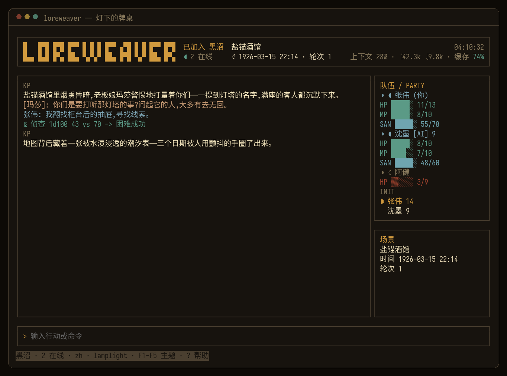

# Loreweaver

**「你喜欢的角色,不该只活在对话框里。」**

带上 TA,去经历一个完整的世界:骰子决定成败,规则守住真实,留下共同历经世事的痕迹。你们一起冒险、一起失败、一起把故事走完。

你们都不知道剧本——**你们共同创造故事。**

*[English](README.md) · 中文*

Loreweaver 是开源的 AI 守秘人:你和朋友出人,带上你们喜欢的同伴角色卡,AI 守秘人来带团。它读模组、记世界、扮演每一个 NPC、守住每一条线索,你只管坐下来说"我要做什么"。它跟"和 AI 聊天"的根本区别是:**骰子是真的**。检定、伤害、理智,全由代码掷骰、按规则结算,AI 只负责把结果讲成故事——**故事归 AI,账归代码。**

支持《克苏鲁的呼唤》7 版和 D&D 5e(SRD),中英双语,服务器跑在你自己的电脑上。

[](https://github.com/1A7432/loreweaver/actions/workflows/ci.yml)   

> **实话实说**:项目还很年轻,基本是一个人带着 AI 写出来的。骰子和规则这部分最扎实,有整套离线测试盯着;终端客户端用起来也顺手了。联网多人和 AI 带团的稳定度还在磨——哪些能用、哪些还差点,[路线图](docs/roadmap.zh.md)里写得清楚。



## 开一局,只要点一个按钮

装好客户端,点连接屏上的绿色按钮「**本地开服并开玩**」——就这样,没有第二步。

它会自动下载对应你系统的服务器程序(自包含,**不用装 Python、不用配环境**),起服、发钥匙,然后把你以守秘人身份直接送进主菜单。纯净的 Windows 10/11、macOS(Apple silicon)、Linux,我们都从裸系统一键点到进桌验证过。

装客户端就一行。macOS / Linux:

```bash
curl -fsSL https://raw.githubusercontent.com/1A7432/loreweaver/main/clients/install.sh | bash
```

Windows(PowerShell):

```powershell
irm https://raw.githubusercontent.com/1A7432/loreweaver/main/clients/install.ps1 | iex
```

装好之后:

```bash
loreweaver          # 启动它,点那个按钮
loreweaver update   # 以后升级也是一行
```

> 🇨🇳 GitHub 慢或连不上?换国内镜像——macOS / Linux:
>
> ```bash
> curl -fsSL https://1a7432.site/trpg/install.sh | bash
> ```
>
> Windows(PowerShell):
>
> ```powershell
> irm https://1a7432.site/trpg/install.ps1 | iex
> ```

服务器程序也可以自己拿去服务器上长期部署:[GitHub Releases](https://github.com/1A7432/loreweaver/releases/tag/latest) 上有 Windows / macOS / Linux(x64 + arm64)四份 `loreweaver-server-*`,解压即跑,`--doctor` 一键体检。

## 把朋友拉进来

开服之后,你屏幕上有两样东西:一个 **ticket**(p2p 地址)和一把**守秘人钥匙**。建房、发邀请码都在主菜单「房间与邀请」里做——每个朋友一个码。

朋友那边:装客户端(上面那一行),贴上你发的 ticket 和邀请码,起个昵称,进来。

**不用买域名、不用配证书、不用开端口转发。** 连接走 p2p(Iroh,QUIC 直连,打不通走中继,端到端加密);ticket 存在你本地,重启也不变——**发一次,一直能用**。没有注册这回事,邀请码就是入场券;想要个副 KP,就发一把守秘人角色的钥匙。掉线会自动重连,回来接着玩。

## 它凭什么不一样

现有的工具就两类:骰子机器人(SealDice、Avrae)——骰子很硬,但没人带团;角色扮演聊天(SillyTavern/酒馆)——聊得热闹,但没有规则、没有世界,你永远不会失败。Loreweaver 把两边都缺的那块补上了:

| | 真骰子/规则 | AI 守秘人 | 持久世界+故事 | AI 队友 | 自托管 · p2p 联机 |
|---|:---:|:---:|:---:|:---:|:---:|
| 骰子机器人 | ✅ | ❌ | ❌ | ❌ | ~ |
| 人物卡聊天 | ❌ | ~ | ❌ | ~ | ~ |
| **Loreweaver** | ✅ | ✅ | ✅ | ✅ | ✅ |

(最后一列的「~」:骰子机器人能自托管,但联机得挂在 QQ/Discord 这类平台上;酒馆能自托管,但本质是单人。Loreweaver 的服务器在你自己电脑上,朋友 p2p 直连进来玩。)

丑话说在前:AI 带团带得好不好,很看你接的模型能力水平。指令遵循好的模型会老老实实掷骰、贴着模组走;能力过差模型容易爱嘴上说说、自由发挥。怎么选,见[给开发者](#给开发者从源码跑起来)。

## 怎么玩

<p align="center">
  
  
</p>
<p align="center">
  
  
</p>

- **建卡有四条路**:掷骰生成、手动逐项填(超预算界面直接拦)、写段人设让 AI 起草、或者把酒馆(SillyTavern)的卡直接丢进来。不管哪条路,最后都要过规则这一关——数值不合规,AI 说破天也没用。
- **键盘鼠标都能用**。KP 思考时有转圈提示,不用对着静止的屏幕干猜;顶栏摆着场景、游戏内时间、轮次、连接状态灯和 token/缓存开销;掉线自动重连。
- 发邀请码、换模型、导模组、管 KP 技能是守秘人的事,用守秘人钥匙连进来才看得到这些页面。
- 想查命令?掷骰、检定、角色卡、守秘人命令的完整参考在**[玩家指令手册](https://1a7432.site/commands.html)**。

## 亮点

- **AI 是真的在带团,不是在陪聊**。掷骰、翻角色卡、记笔记、推时钟,都是它实际操作引擎完成的动作,一共 60 多个守秘人工具。接哪家模型都行,推荐 `deepseek-v4-pro` 开思考。
- **NPC 不开天眼**。每个 NPC、每个 AI 队友,只知道自己该知道的事,剧情的底牌根本不在它们手里——想剧透都没得透。缺人的时候,AI 队友真能顶上一个位置:用自己的卡,掷自己的骰。
- **想要什么,说一句就有**。新规则系统、新玩法、新模组,在管理页里描述一下,KP 当场写好、校验、装上就能用。写出来的全是通用格式(酒馆卡、世界书、SKILL.md、YAML 规则包),你收藏的老资源也能直接搬进来。细节见 [docs/plugins.md](docs/plugins.md)。
- **感情戏也有账本**。开了浪漫这个 KP 技能之后,好感和情欲是实打实的数值:涨了就是涨了,由代码记账,不看 AI 心情。
- **两套指令习惯都认**。中文 SealDice 那套(`.ra 侦查`、`.st 力量50`)和英文 Avrae 那套(`/roll 4d6kh3`、`adv/dis`),背后是同一个骰子引擎。
- **内容过滤默认关闭**。私人团想怎么跑怎么跑;真要开,也只过滤 KP 的输出,不碰玩家输入(见 [docs/deploy.zh.md](docs/deploy.zh.md#内容审核))。

## 给开发者:从源码跑起来

```bash
uv sync                                  # 建环境、装依赖

# 先离线尝个鲜——不用 API key,内置演示 KP + 真骰子:
uv run python -m app --cli               # 试试  r 3d6+2 · /roll 4d6kh3 · .ra 侦查 · .setcoc 2

# 接真模型:复制 .env.example 为 .env,填上你的 key,再跑一次:
uv run python -m app --cli
# (没有 uv?python3 -m venv .venv && . .venv/bin/activate && pip install -e ".[dev,anthropic,gemini]")
```

`.env` 这样写(以 DeepSeek 为例,别家同理,OpenAI 兼容或原生都行):

```
TRPG_LLM__PROVIDER=deepseek   TRPG_LLM__API_KEY=sk-…
TRPG_LLM__CHAT_MODEL=deepseek-v4-pro   TRPG_LLM__REASONING_EFFORT=high
```

> **模型别太省。** KP 全靠调用工具干活:强模型(deepseek-v4-pro 开思考、GPT-4 级、Claude)会真掷骰、贴着模组走;太便宜的模型常常嘴上说"你成功了"却根本没掷,还爱把团带偏。游戏里 `.model set <provider> [model]` 随时热切,不用重启。

**终端界面(真正的体验):**

```bash
uv run python -m app --serve   # 起 p2p 服务端,打印 ticket 和守秘人钥匙
# 另开一个终端:
cd clients/tui && bun install && bun run dev
```

把 ticket 和钥匙贴进连接屏就行。更省事的办法:直接点连接屏上的「本地开服并开玩」,这些它全帮你干了。

### 跑一台常驻服务器(可选)

多数团在笔记本上 p2p 就开了。想要 7×24 常驻,找台机器:

```bash
uv sync && uv run python -m app --serve   # 用 systemd 守着——见 docs/deploy.zh.md
```

首次运行会生成 `.env`,并自动发一把守秘人钥匙(打印出来,也存在 `keeper-key.txt`)。用它连进去,之后发码、建房都在客户端里做。数据(SQLite + 钥匙)就存在程序旁边。完整说明见 **[docs/deploy.zh.md](docs/deploy.zh.md)**。

## 游玩入口

| 入口 | 状态 |
|---|---|
| **终端 · OpenTUI** | ✅ **主力**——上面那个游戏大厅;本地或联网 p2p(Iroh) |
| CLI(无头) | ✅ 开发 / 快速试玩 / 离线 demo |

系统:D&D 5e SRD 和 CoC 7 版以数据驱动的 rulepack(`rulepacks/*.yaml`)随附——加新系统不用改代码。(Discord/Telegram/QQ/飞书这些聊天平台适配器还在仓库里,但没人维护、没在真平台上测过,见[路线图](docs/roadmap.zh.md)。)

## 架构

```
core/  确定性引擎        infra/  store · config · i18n · llm · embeddings · vector · providers
agent/ AI-KP 大脑 + 工具  gateway/ 平台无关层:commands · ops · hub · runner · director
net/   Iroh p2p + 会话核心  adapters/ cli(聊天适配器在树内、无人维护)   clients/ protocol · tui
```

引擎用稳定的 `chat_key` 隔离全部状态;RoomHub 再叠一层跨端实时广播。分层契约、铁律(确定性 vs 生成、掷骰优先、信息隔离),以及怎么加 rulepack / 适配器 / provider / 工具 / 客户端,都在 **[AGENTS.md](AGENTS.md)**。客户端线格式见 **[docs/protocol.zh.md](docs/protocol.zh.md)**。

## 测试

```bash
uv run pytest -q                            # 离线:FakeLLM + seed 骰子,不联网、不用 key
uv run ruff check core infra agent gateway net adapters app.py scripts
uv run python scripts/i18n_lint.py          # 不许有硬编码的文案
cd clients/tui && bun install && bun test   # 客户端(protocol · tui)
```

955 个测试,全程离线、结果可复现。自 play 测试用脚本化的 KP 把整条链路跑一遍(传模组 → 分析 → 开团 → 玩家行动 → 真骰检定 → 战报);"秘密进不了玩家池""NPC 只由自己的档案组装"这些底线,各有专门的红线测试守着。

离线测试证明的是流程正确;真模型守不守规矩,另有一道**每夜跑的真模型红线评测**(`.github/workflows/redline-eval.yml`):脚本化玩家陪真模型跑几十个回合,逐回合量化"剧透率"和"该掷骰没掷率",超阈值就红。这道闸门刚架起来的时候抓到的是真问题——KP 在战斗叙事和战斗表格里管不住嘴,泄密率 45.8%;六轮修复-复测之后,稳定在 0。它只按计划跑、不卡 PR;没配 `EVAL_LLM_API_KEY` 时自动跳过。CI(push/PR)跑 Python 3.11/3.12 和各客户端包,全程离线。

## 参与贡献

欢迎 PR 和 issue。提交前把这些跑绿:`uv run ruff check …`、`uv run python scripts/i18n_lint.py`、`uv run pytest -q`(以及相关的 `bun test`)。守住 [AGENTS.md](AGENTS.md) 里的铁律——尤其是文案必须走 i18n、信息隔离不能破。规则内容只收开放许可的(SRD / 米斯卡塔尼克);模组请运行时自备。最缺人手的地方列在[路线图](docs/roadmap.zh.md)里。

野心在路线图里写得很直白:做 RPG 领域的 Claude Code——连终端优先,都是同一种审美。

## 安全

别提交任何密钥——`.env`、发出的钥匙、SSH host key、数据库都已 gitignore(只提交 `*.example.*`)。

没有账号系统:邀请码就是通行证,它把玩家绑到某个房间、带玩家或守秘人角色。要面向可信小圈子以外开放,请自己在前面加鉴权和 TLS,别直接裸奔公网——任何自托管服务都该有的卫生习惯。

发现漏洞?请在 GitHub 开私有安全通告,别开公开 issue。

## 许可与致谢

MIT——见 [`LICENSE`](LICENSE) 和 [`NOTICE`](NOTICE)。含 **D&D 5e SRD 5.1**(CC-BY-4.0)材料;克苏鲁内容仅限开放 / 米斯卡塔尼克仓库许可范围。gateway/适配器层派生自 **hermes-agent**(MIT,© 2025 Nous Research);骰子引擎是 **avrae/d20**(MIT);中文命令方言、CoC 成功函数与技能别名表参照 **SealDice**(MIT)重写;终端客户端用 **OpenTUI**。本仓库不随附任何受版权保护的冒险/模组文本。

友情链接:[LINUX DO](https://linux.do/)——我们常驻的社区。

## 路线图

完整计划见 **[docs/roadmap.zh.md](docs/roadmap.zh.md)**。更远的方向:会生长的世界引擎(生成式世界、活的因果时间线、设定一致性)、迟到玩家的剧情追进度、D&D Beyond 角色卡导入,以及把聊天适配器放到真平台上端到端测一遍。
