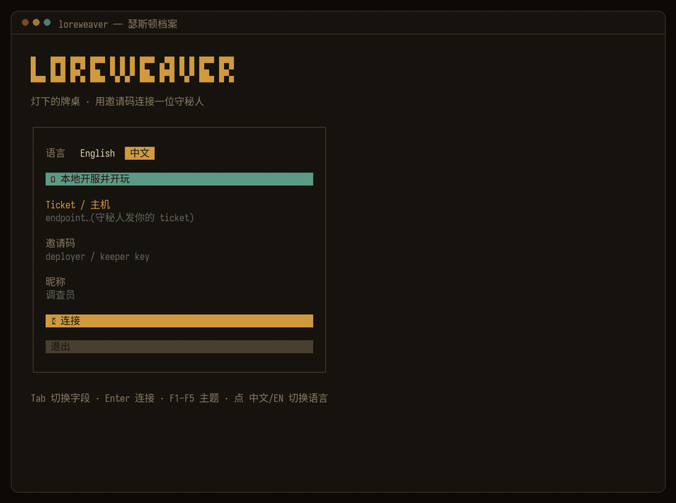
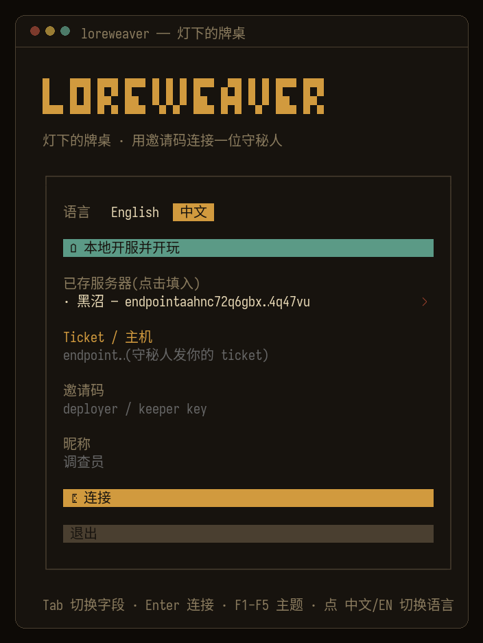
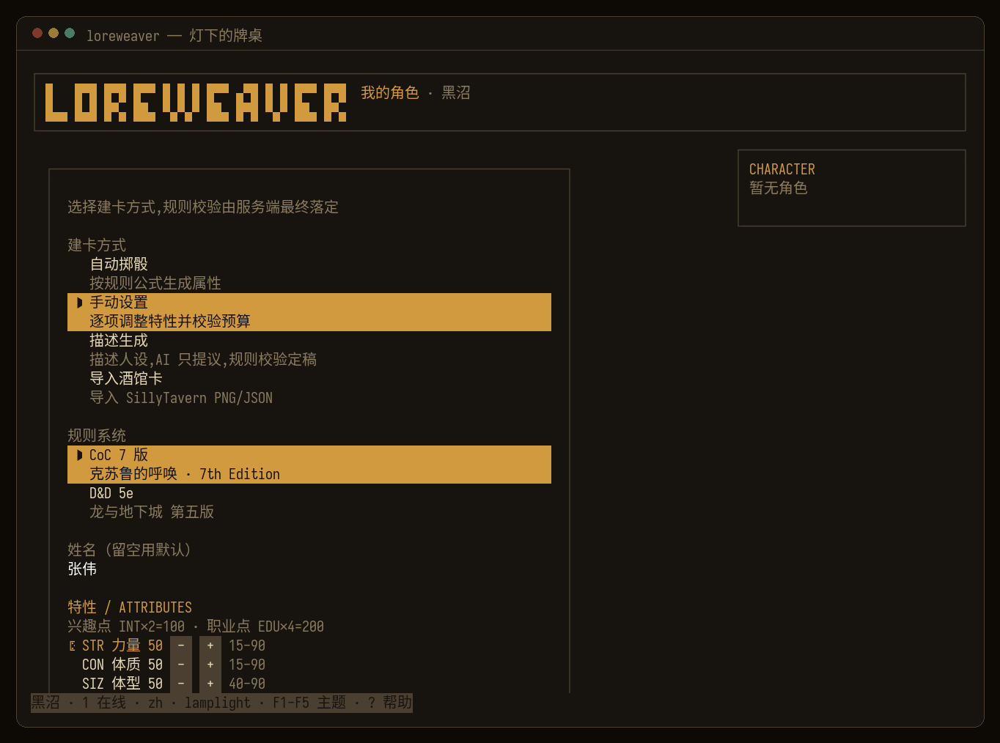
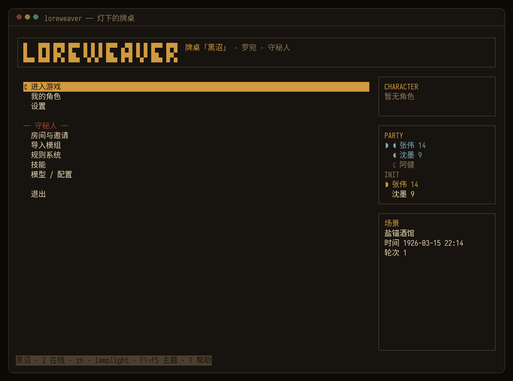
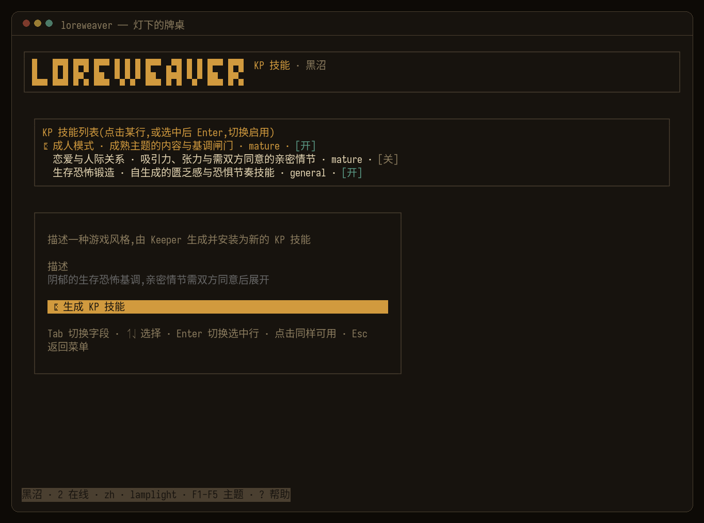

# Loreweaver

**「你喜欢的角色，不该只活在对话框里。」**

带上 TA，去经历一个完整的世界：骰子决定成败，规则守住真实，留下共同历经世事的痕迹。你们一起冒险、一起失败、一起把故事走完。

你们都不知道剧本——**你们共同创造故事。**

*[English](README.md) · 中文*

Loreweaver 是一个开源的 AI 守秘人：你和朋友出人，带上你们喜欢的同伴角色卡，AI 来带团。模组、世界状态、NPC 都归它管，你坐下来说"我要做什么"就行。它和普通 AI 聊天最大的区别是骰子是真的：检定、伤害、理智全是代码按规则算出来的，AI 只负责把结果讲成故事。**故事归 AI，账归代码。**

支持《克苏鲁的呼唤》7 版和 D&D 5e(SRD)，中英双语，服务器跑在你自己的电脑上。

[](https://github.com/1A7432/loreweaver/actions/workflows/ci.yml)   

**链接：**[项目主页](https://1a7432.site) · [玩家指令手册](https://1a7432.site/commands.html) · [GitHub 仓库](https://github.com/1A7432/loreweaver)

> **实话实说**：项目还很年轻，基本是一个人带着 AI 写出来的。骰子和规则这部分最扎实，有整套离线测试盯着；终端客户端用起来也顺手了。联网多人和 AI 带团的稳定度还在磨，哪些能用、哪些还差点，[路线图](docs/roadmap.zh.md)里写得清楚。



*真实会话、真实模型、真实骰子——终端客户端实录。*

## 开一局，只要点一个按钮

装好客户端，在连接屏点绿色按钮「**本地开服并开玩**」就行，没有第二步。

它会自动下载对应你系统的服务器程序（自包含的，不用装 Python 也不用配环境），起服、发钥匙，然后直接把你以守秘人身份送进主菜单。这条链路在纯净的 Windows 10/11、macOS（Apple silicon）和 Linux 上都从头点过一遍，能通。

**不配 API key 也能先尝一口**：没配模型且房间为空时，守秘人菜单会出现「**试玩示例冒险**」。内置的脚本化守秘人会装好灯塔短篇，并实际走一遍真骰子/规则链路；服务端会在载入前再次确认房间为空，过期菜单不会覆盖已有战役。准备好后在模型页填 provider；正在运行的服务会立即切换，重启后也会恢复这项配置。

客户端装起来就一行。macOS / Linux：

```bash
curl -fsSL https://github.com/1A7432/loreweaver/releases/latest/download/install.sh | bash
```

Windows(PowerShell):

```powershell
irm https://github.com/1A7432/loreweaver/releases/latest/download/install.ps1 | iex
```

不想装到 `C:\Users\<用户名>` 下面的话，安装前先指定目录。连接屏也会显示当前
「本地服务器目录」，点「本地开服并开玩」前可以直接改：

```powershell
$env:TRPG_HOME="D:\Loreweaver"
$env:TRPG_LOCAL_SERVER_HOME="D:\Loreweaver\server-state"
irm https://github.com/1A7432/loreweaver/releases/latest/download/install.ps1 | iex
```

一键开服时，服务端 `.env` 放在这个本地服务器目录里；数据、钥匙、ticket、服务器
程序/源码缓存也都在这里。

Windows 上请尽量用 **Windows Terminal** 或 **WezTerm** 跑 TUI。如果界面不像截图——
边框错位、颜色不对、Unicode 字符异常、鼠标输入失灵——多半是终端模拟器问题。
Windows 11 也可能因为启动方式或默认终端设置进到旧控制台。请安装/打开
[Windows Terminal](https://github.com/microsoft/terminal#installing-and-running-windows-terminal)
或 [WezTerm](https://wezterm.org/install/windows.html)，再在里面运行 `loreweaver`。

装好之后：

```bash
loreweaver          # 启动它，点那个按钮
loreweaver update   # 以后升级也是一行
```

想装回旧版的话，到 [GitHub Releases](https://github.com/1A7432/loreweaver/releases) 里选一个 tag，然后安装前设置 `TRPG_RELEASE_TAG=release-...`；客户端 tarball 和一键本地开服下载的服务器程序会来自同一个 Release。

Release 安装器会先校验客户端压缩包的 SHA-256，一键开服下载服务端时也一样；校验不通过就拒绝解压。默认依赖源是 npm 官方仓库；确实需要镜像时仍可显式设置 `TRPG_REGISTRY`。

> 🇨🇳 GitHub 慢或连不上？换国内镜像。macOS / Linux：
>
> ```bash
> curl -fsSL https://1a7432.site/trpg/install.sh | bash
> ```
>
> Windows(PowerShell):
>
> ```powershell
> irm https://1a7432.site/trpg/install.ps1 | iex
> ```

服务器程序也可以自己拿去服务器上长期部署：[GitHub Releases](https://github.com/1A7432/loreweaver/releases) 目前提供 Windows x64、macOS arm64、Linux x64/arm64 四份 `loreweaver-server-*`，解压即跑，`--doctor` 一键体检。

## 把朋友拉进来

开服之后你屏幕上会有两样东西：一个 ticket（相当于这台服务器的 p2p 地址）和一把守秘人钥匙。建房、给朋友发邀请码，都在主菜单的「房间与邀请」里操作，一人一个码。

朋友那边更简单：装好客户端，把你发的 ticket 和邀请码贴进去，起个昵称就进来了。

不需要域名、证书、端口转发这些东西。连接走的是 p2p（Iroh，QUIC 直连，打洞失败自动走中继，端到端加密）；ticket 存在你本地，重启也不会变，发一次以后一直用。没有账号注册这回事，邀请码本身就是入场券；掉线会自动重连，回来接着玩。

守秘人 key 是房间管理员凭据：持有者可以读取该房间的守秘人资料、管理该房间邀请码，而模型/provider 设置会影响整台部署。只把守秘人 key 发给完全信任的人。

## 它凭什么不一样

市面上的工具基本就两类：骰子机器人（SealDice、Avrae）这边骰子很硬，但没人带团；角色卡聊天（SillyTavern/酒馆）那边聊得很热闹，但没有规则也没有世界，你永远不会失败。Loreweaver 想补的就是两边都缺的那块：

| | 真骰子/规则 | AI 守秘人 | 持久世界+故事 | AI 队友 | 自托管 · p2p 联机 |
|---|:---:|:---:|:---:|:---:|:---:|
| 骰子机器人 | ✅ | ❌ | ❌ | ❌ | ~ |
| 人物卡聊天 | ❌ | ~ | ❌ | ~ | ~ |
| **Loreweaver** | ✅ | ✅ | ✅ | ✅ | ✅ |

（最后一列的「~」：骰子机器人能自托管，但联机得挂在 QQ/Discord 这类平台上；酒馆能自托管，但本质是单人。Loreweaver 的服务器在你自己电脑上，朋友 p2p 直连进来玩。）

丑话说在前：AI 带团带得好不好，很看你接的模型能力水平。指令遵循好的模型会老老实实掷骰、贴着模组走；能力过差模型容易爱嘴上说说、自由发挥。怎么选，见[给开发者](#给开发者从源码跑起来)。

## 怎么玩

<p align="center">
  
  
</p>
<p align="center">
  
  
</p>

- 建卡有四条路：掷骰生成、手动逐项填（超预算会直接拦下）、写段人设让 AI 起草，或者把酒馆的卡直接丢进来。不管走哪条，最后都要过规则校验这一关，数值不合规，AI 说破天也没用。
- 键盘鼠标都能用。KP 思考的时候有个转圈提示，不用对着静止的屏幕干等；顶栏放着场景、游戏内时间、轮次、连接状态灯和 token/缓存开销这些信息。
- 发邀请码、换模型、导模组、管 KP 技能是守秘人的事，用守秘人钥匙连进来才看得到这些页面。
- 指令的完整参考（掷骰、检定、角色卡、守秘人命令）单独放在[玩家指令手册](https://1a7432.site/commands.html)里。

## 亮点

- AI 是真的在带团，不是陪聊。掷骰、翻角色卡、记笔记、推时钟，这些都是它通过 60 多个守秘人工具实际操作引擎完成的。许多 OpenAI-compatible 和原生 provider 都能接，但模型能力仍然重要；当前推荐 `deepseek-v4-pro` 开思考。
- NPC 不开天眼。NPC 和 AI 队友只由自己的档案与角色卡组装，绝不会拿到守秘人池。主守秘人不同：它为了主持谜团会看到模组秘密，所以防泄漏要靠真实模型评测，不能宣传成纯架构保证。缺人的时候 AI 队友可以拿自己的卡、掷自己的骰来补位。
- 想要新东西，描述一句就行。新规则系统、新玩法、新模组，在管理页里说清楚你要什么，KP 当场生成、校验、装上。产出的都是通用格式（酒馆卡、世界书、SKILL.md、YAML 规则包），反过来你收藏的老资源也能直接搬进来。细节在 [docs/plugins.md](docs/plugins.md)。
- 感情戏也有账本。开了浪漫 KP 技能之后，好感和情欲就是实打实的数值，涨没涨代码说了算，不看 AI 心情。
- 两套指令习惯都认：中文海豹那套（`.ra 侦查`、`.st 力量50`）和英文 Avrae 那套（`/roll 4d6kh3`、`adv/dis`），背后是同一个骰子引擎。
- 内容过滤默认是关的，私人团想怎么跑怎么跑。真要开的话，也只过滤 KP 的输出，不碰玩家输入（见 [docs/deploy.zh.md](docs/deploy.zh.md#内容审核)）。

## 给开发者：从源码跑起来

```bash
uv sync                                  # 建环境、装依赖
# 可选的 Mock 测试聊天适配器（QQ/OneBot 不需要 extra）：
uv sync --extra discord --extra telegram --extra feishu

# 先离线尝个鲜——不用 API key,内置演示 KP + 真骰子：
uv run python -m app --cli               # 试试  r 3d6+2 · /roll 4d6kh3 · .ra 侦查 · .setcoc 2

# 接真模型：复制 .env.example 为 .env,填上你的 key,再跑一次：
uv run python -m app --cli
# (没有 uv?python3 -m venv .venv && . .venv/bin/activate && pip install -e ".[dev,anthropic,gemini]")
```

`.env` 这样写（以 DeepSeek 为例，别家同理，OpenAI 兼容或原生都行）:

```
TRPG_LLM__PROVIDER=deepseek   TRPG_LLM__API_KEY=sk-…
TRPG_LLM__CHAT_MODEL=deepseek-v4-pro   TRPG_LLM__REASONING_EFFORT=high
```

> **模型别太省。** KP 全靠调用工具干活：强模型（deepseek-v4-pro 开思考、GPT-4 级、Claude）会真掷骰、贴着模组走；太便宜的模型常常嘴上说"你成功了"却根本没掷，还爱把团带偏。游戏里 `.model set <provider> [model]` 随时热切，不用重启。

**终端界面（真正的体验）：**

```bash
uv run python -m app --serve   # 起 p2p 服务端，打印 ticket 和守秘人钥匙
# 另开一个终端：
cd clients/tui && bun install && bun run dev
```

把 ticket 和钥匙贴进连接屏就行。更省事的办法：直接点连接屏上的「本地开服并开玩」，这些它全帮你干了。

### 跑一台常驻服务器（可选）

多数团在笔记本上 p2p 就开了。想要 7×24 常驻，找台机器：

```bash
uv sync && uv run python -m app --serve   # 用 systemd 守着——见 docs/deploy.zh.md
```

启动时会读取你自己创建的 `.env`，但不会替你凭空生成 provider 凭据。keystore 不存在时，服务端会自动发一把守秘人钥匙（打印出来，也存在 `keeper-key.txt`）。用它连进去，之后发码、建房都在客户端里做。SQLite 战役数据服从 `TRPG_DATA_DIR`；钥匙库服从 `--keys` / `TRPG_TUI_KEYS`（默认 `./keys.toml`）。完整说明见 **[docs/deploy.zh.md](docs/deploy.zh.md)**。

## 游玩入口

| 入口 | 状态 |
|---|---|
| **终端 · OpenTUI** | ✅ **主力**：上面那个游戏大厅；本地或联网 p2p(Iroh) |
| Discord Bot | 🧪 实验性：原生命令、卡片、附件、面板和语音 |
| QQ 官方机器人 | 🧪 实验性：Markdown/Keyboard 与富媒体，支持纯文本降级 |
| Telegram Bot | 🧪 实验性：polling、话题/回复、媒体、内联控件与私聊 |
| 飞书 Bot | 🧪 实验性：受监督长连接、mention/thread/回复、媒体与卡片内容纯文本降级 |
| OneBot 11 | 🧪 实验性：正向/反向 universal WebSocket、消息段、媒体与私聊 |
| CLI（无头） | ✅ 开发 / 快速试玩 / 离线 demo |

系统：D&D 5e SRD 和 CoC 7 版以数据驱动的 rulepack（`rulepacks/*.yaml`）随附，加新系统不用改代码。上面的所有网络适配器都能共用同一个跨平台房间，但在各自真平台清单通过前都只是经过 Mock 测试的 **Experimental**。OpenTUI 仍是主力游玩方式；见[聊天平台配置与冒烟清单](docs/chat-platforms.zh.md)。

## 架构

```
core/  确定性引擎        infra/  store · config · i18n · llm · embeddings · vector · providers
agent/ AI-KP 大脑 + 工具  gateway/ 平台无关层：commands · ops · hub · runner · director
net/   Iroh p2p + 会话核心  adapters/ CLI · Discord · QQ · Telegram · 飞书 · OneBot  clients/ protocol · tui
```

引擎用稳定的 `chat_key` 隔离全部状态；RoomHub 再叠一层跨端实时广播。分层契约、铁律（确定性 vs 生成、掷骰优先、信息隔离），以及怎么加 rulepack / 适配器 / provider / 工具 / 客户端，都在 **[AGENTS.md](AGENTS.md)**。客户端线格式见 **[docs/protocol.zh.md](docs/protocol.zh.md)**。

## 测试

```bash
uv run pytest -q                            # 离线：FakeLLM + seed 骰子，不联网、不用 key
uv run ruff check core infra agent gateway net adapters app.py scripts
uv run python scripts/i18n_lint.py          # 不许有硬编码的文案
cd clients/tui && bun install && bun test   # 客户端(protocol · tui)
```

超过 1,000 个测试全程离线、结果可复现。其中一组 self-play 测试会用脚本化的 Keeper 把整条链路跑一遍（传模组 → 分析 → 开团 → 玩家行动 → 真骰检定 → 战报）。专门的红线测试能证明守秘人资料进不了玩家知识池、NPC/同伴只能由各自的作用域档案组装；它们不能证明看过秘密的主 Keeper 模型永远不会复述秘密。

离线测试只能证明流程对；真模型守不守规矩是另一回事，所以另有一道[每夜真实模型红线评测](https://github.com/1A7432/loreweaver/actions/workflows/redline-eval.yml)。脚本化玩家对当前配置的模型逐回合统计秘密泄漏和“该掷骰没掷”，超过阈值、provider 调用失败或鉴权失败都会报红。结果只代表特定模型的某一次运行，不是永久保证：例如 [2026-07-07 的运行](https://github.com/1A7432/loreweaver/actions/runs/28847688245) 在短测 24 回合中测到 1 次泄漏、6 个应检定回合中漏骰 1 次，长测两项都是 0；之后两次定时运行在开始评测前就因 provider 拒绝凭据而失败。没配 `EVAL_LLM_API_KEY` 时工作流会跳过，而且不卡 PR。push/PR CI 覆盖 Python 3.11/3.12 与客户端包，全程离线。

## 参与贡献

欢迎 PR 和 issue。提交前把这些跑绿：`uv run ruff check …`、`uv run python scripts/i18n_lint.py`、`uv run pytest -q`(以及相关的 `bun test`)。守住 [AGENTS.md](AGENTS.md) 里的铁律，尤其是文案必须走 i18n、信息隔离不能破。规则内容只收开放许可的（SRD / 米斯卡塔尼克）；模组请运行时自备。最缺人手的地方列在[路线图](docs/roadmap.zh.md)里。

野心在路线图里写得很直白：做 RPG 领域的 Claude Code——连终端优先，都是同一种审美。

## 安全

自托管意味着确定性引擎、战役数据库、钥匙和文件由你控制，**不意味着接了云模型之后数据仍不出本机**。远程 LLM 会收到用于分析的模组正文、Keeper system prompt（其中包含守秘人资料）、相关历史与本轮玩家输入。标准应用默认使用本地 hash embedder；只有显式接入远程 embedding backend 时，文档分块才会发往该 backend。若这些 prompt 必须留在自己控制的基础设施，请使用 Ollama、LM Studio 等本地 endpoint。Iroh 的端到端加密保护 OpenTUI 玩家到服务端的传输；它和模型 provider 是两条不同的信任边界。Discord、QQ、Telegram 与飞书流量必然经过相应平台服务，OneBot 则取决于所配置 WebSocket 链路的安全性；见[部署信任模型](docs/deploy.zh.md#数据流与信任边界)。

运行时 provider API key 和 OAuth grant 会以未加密形式保存在本地 SQLite 中，以便重启后继续使用。文件系统支持 POSIX mode 时，新建的敏感文件会收紧为仅本机用户可读写、专用数据目录仅本机用户可访问；但它不是密码库。请保护宿主账号、备份、`.env`、`keys.toml`、`keeper-key.txt` 和 `*.db`，也别提交它们。完整边界见[数据流与信任边界](docs/deploy.zh.md#数据流与信任边界)。

这里没有账号找回或中心身份服务：随机 key 本身就是凭据，把持有者绑定到一个房间及玩家/守秘人角色。Iroh 已对 p2p 连接做加密与对端认证；实际运维风险是 key 泄漏或宿主机失陷，而不是缺一张反向代理证书。丢失的 key 要及时撤销，并把每一把守秘人 key 都视为该房间及整台部署模型配置的可信管理员凭据。

发现漏洞？请在 GitHub 开私有安全通告，别开公开 issue。

## 许可与致谢

MIT——见 [`LICENSE`](LICENSE) 和 [`NOTICE`](NOTICE)。含 **D&D 5e SRD 5.1**(CC-BY-4.0)材料；克苏鲁内容仅限开放 / 米斯卡塔尼克仓库许可范围。gateway/适配器层派生自 **hermes-agent**(MIT,© 2025 Nous Research)；骰子引擎是 **avrae/d20**(MIT)；中文命令方言、CoC 成功函数与技能别名表参照 **SealDice**(MIT)重写；终端客户端用 **OpenTUI**。本仓库不随附任何受版权保护的冒险/模组文本。

友情链接：[LINUX DO](https://linux.do/)——我们常驻的社区。

## 路线图

完整计划见 **[docs/roadmap.zh.md](docs/roadmap.zh.md)**。更远的方向：会生长的世界引擎（生成式世界、活的因果时间线、设定一致性）、迟到玩家的剧情追进度、D&D Beyond 角色卡导入，以及把聊天适配器放到真平台上端到端测一遍。
